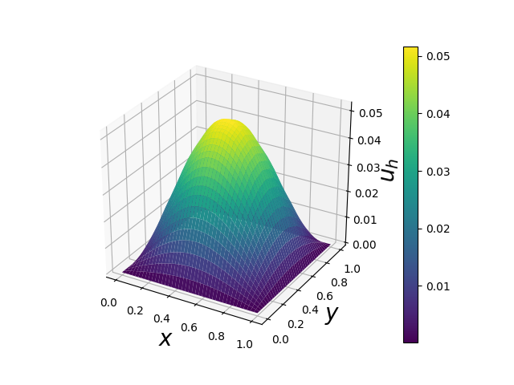
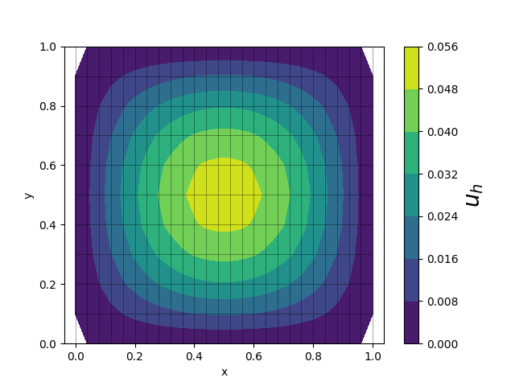

# SimpleFEM
This repository contains a Finite Element Solver for the Poisson equation - &Delta; u = f on &Omega; = [0,1]&#215;[0,1],
a unit square consisting of N<sub>x</sub> elements in the x direction, N<sub>y</sub> elements in the y-direction.
The elements are four-noded quadrilateral elements.

## Structure:
To run the example: `python3 problem.py`.

Following is a list describing the contents of each file:
- **assembly.py**: Contains assembly routines for the Stiffness matrix, the right hand side and integration of a single finite 
element function.
- **dolfin_reference.py**: A dolfin implementation of the problem, used for verification of the solution in *test_solutions.py*.
- **functionspace.py**: Contains the implementation of a minimal version of the function space for
first order Lagrange elements on quadrilaterals, corresponding to having dofs at each vertex.
- **mesh.py**: Contains the implementation of the UnitSquareMesh
- **plotting.py**: Contains several plotting routines for visualising the solution.
- **problem.py**: Contains the example where f=4(-y<sup>2</sup>+y) sin(&#960; x).
- **test_solution.py**: Compares &#8747; u dx obtained with this finite element solver a FEniCS implementation.


## Dependencies
This finite element solver uses the numpy, sympy, scipy and matplotlib library.
To run the comparasion of results with dolfin, you can use the FEniCS docker image, running
```
docker run --rm -ti -v $(pwd):/home/fenics/shared/ -w /home/fenics/shared/ quay.io/fenicsproject/stable:latest
```

## Results
Running `problem.py` produces the following figures:

- **Solution of the Poisson equation on a 25&#215;10 grid with f=4(-y<sup>2</sup>+y) sin(&#960; x)**


- **Visualization of the solution from a 25&#215;10 with the exact values on a 40&#215;40 grid.**


- **Contour-plot of the solution from a 25&#215;10 grid.**

